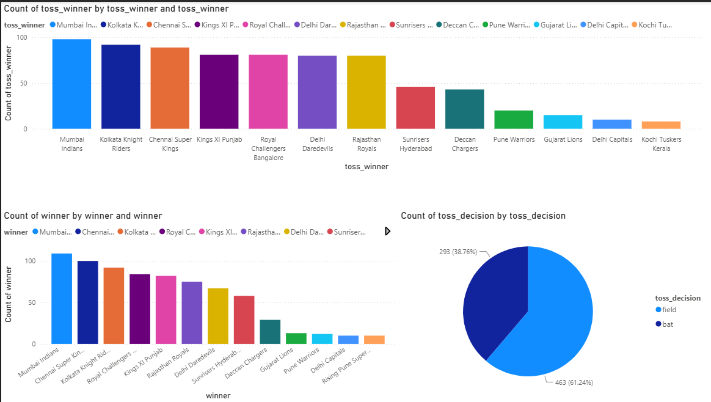
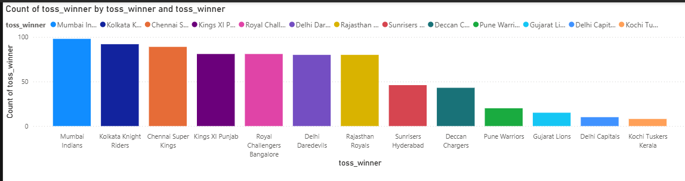
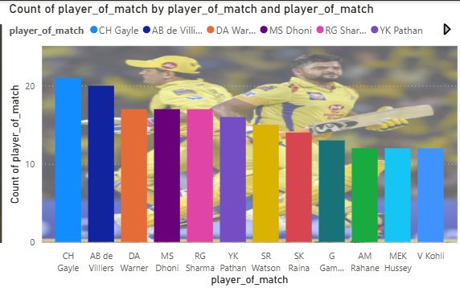
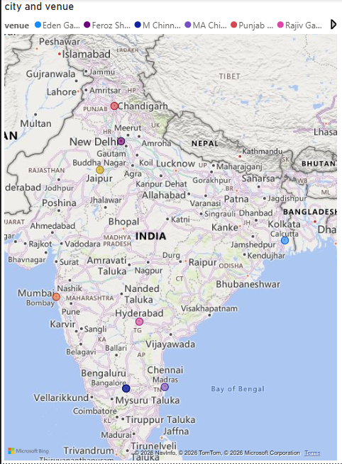
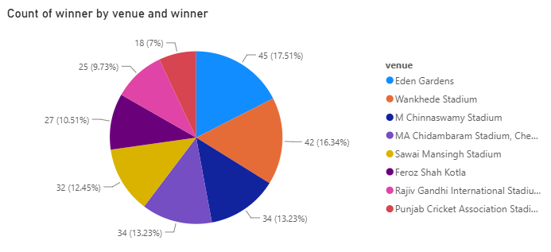

# 🏏 IPL Deliveries & Matches Visualization Analysis using Power BI

A complete Sports Analytics & Business Intelligence Project built using Power BI, CSV datasets, Power Query, and DAX to analyze Indian Premier League (IPL) matches and ball-by-ball deliveries through an interactive dashboard.

This project transforms raw IPL match and delivery data into meaningful cricket insights that help understand team performance, player statistics, batting trends, bowling efficiency, venue analysis, and match-winning patterns across multiple IPL seasons.

---

## 📌 Project Overview

The objective of this project is to perform Exploratory Data Analysis (EDA) on IPL match and delivery datasets and build an interactive Power BI dashboard that enables users to explore historical IPL performance through dynamic visualizations and KPI-driven insights.

### Key Analysis Areas

* 🏆 Match Results Analysis
* 🏏 Team Performance Comparison
* 👑 Top Run Scorers Analysis
* 🎯 Top Wicket Takers Analysis
* 📈 Season-wise Performance Trends
* 🏟️ Venue & Stadium Analysis
* ⚡ Powerplay & Death Overs Performance
* 🔄 Toss Impact on Match Results
* 🔥 Boundary & Sixes Analysis
* 📊 Batting vs Bowling Efficiency

---

## 📂 Project Structure

```text
ipl-deliveries-matches-visualization-analysis/
│
├── deliveries.csv                                   # Ball-by-ball IPL delivery data
├── matches.csv                                      # Match-level IPL data
├── IPL_DELIVERIES_MATCHES_VISUALIZATION_ANALYSIS.pbix
│                                                     # Power BI dashboard file
├── screenshots/
│   ├── dashboard_overview.png
│   ├── team_analysis.png
│   ├── player_analysis.png
│   ├── venue_analysis.png
│   └── season_analysis.png
└── README.md
```

---

## 📊 Dataset Information

### Source

IPL historical matches and ball-by-ball deliveries datasets.

### Dataset Summary

| Feature         | Details                              |
| --------------- | ------------------------------------ |
|   Dataset 1     | `matches.csv`                        |
|   Dataset 2     | `deliveries.csv`                     |
|   Domain        | Sports Analytics / Cricket Analytics |
|   Tool Used     | Power BI                             |
|   Data Format   | CSV                                  |
|   Granularity   | Match-level & Ball-by-ball level     |

---

## 🧾 Matches Dataset Columns

The matches.csv file contains match-level information such as:

* `id` – Match ID
* `season` – IPL season
* `city` – Match city
* `date` – Match date
* `team1` – First team
* `team2` – Second team
* `toss_winner` – Toss winning team
* `toss_decision` – Bat / Field
* `result` – Match result type
* `winner` – Match winning team
* `player_of_match` – Player of the match
* `venue` – Stadium / venue
* `umpire1`, `umpire2` – Match officials

---

## 🧾 Deliveries Dataset Columns

The deliveries.csv file contains ball-by-ball information including:

* `match_id` – Match identifier
* `inning` – Innings number
* `batting_team` – Batting team
* `bowling_team` – Bowling team
* `over` – Over number
* `ball` – Ball number
* `batsman` – Striker batsman
* `non_striker` – Non-striker batsman
* `bowler` – Bowler name
* `batsman_runs` – Runs scored by batsman
* `extra_runs` – Extra runs
* `total_runs` – Total runs scored on the delivery
* `player_dismissed` – Dismissed player
* `dismissal_kind` – Type of dismissal
* `fielder` – Fielder involved in dismissal

---

## 🎯 Business / Sports Questions Solved

This dashboard answers important IPL analytics questions such as:

### Match Analysis

1. Which team has won the most IPL matches ?
2. How does toss winning affect match results ?
3. Which venues host the highest number of matches ?

### Team Performance Analysis

4. Which teams have the highest win percentage ?
5. Which teams score the highest average runs per match ?
6. How do teams perform across different IPL seasons ?

### Player Analysis

7. Who are the top run scorers in IPL history?
8. Which bowlers have taken the most wickets ?
9. Which players have won the most Player of the Match awards ?

### Delivery-Level Insights

10. Which overs produce the highest scoring rates ?
11. How many boundaries and sixes are scored by each team?
12. Which bowlers are most effective during death overs ?

---

## 📈 Dashboard Features

The IPL_DELIVERIES_MATCHES_VISUALIZATION_ANALYSIS.pbix dashboard contains interactive Power BI visualizations for comprehensive IPL analysis.

### KPIs Included

* 🏆 Total Matches
* 🏏 Total Runs Scored
* 🎯 Total Wickets Taken
* 👑 Top Run Scorer
* 🔥 Top Wicket Taker
* 🏟️ Total Venues
* 📅 Total Seasons Analyzed

---

## 📊 Visualizations Used

| Analysis                     | Visualization        |
| ---------------------------- | -------------------- |
| Matches by Season            | Line Chart           |
| Team Win Count               | Horizontal Bar Chart |
| Toss Winner vs Match Winner  | Stacked Column Chart |
| Top Run Scorers              | Horizontal Bar Chart |
| Top Wicket Takers            | Horizontal Bar Chart |
| Venue-wise Matches           | Bar Chart            |
| Runs by Over                 | Area / Line Chart    |
| Boundaries Distribution      | Donut Chart          |
| Player of the Match Analysis | Bar Chart            |
| Team-wise Runs vs Wickets    | Scatter Plot         |

---

## 🖥️ Power BI Dashboard

The Power BI dashboard provides an interactive sports analytics solution for IPL historical data analysis.

### Dashboard Highlights

* 🔍 Dynamic filtering and slicers
* 📅 Season-wise trend analysis
* 🏏 Team performance comparison
* 👑 Player statistics exploration
* 🏟️ Venue and city analysis
* 🎯 Bowling performance monitoring
* 📈 Match-winning pattern visualization
* ⚡ Over-by-over scoring insights

---

## 🧹 Data Cleaning & Transformation

The datasets were prepared using **Power Query Editor inside Power BI.

### Cleaning Steps Performed

* Removed duplicate records
* Standardized team names across seasons
* Handled missing values in venue and city fields
* Converted date columns to proper date format
* Created relationships between matches and deliveries tables
* Generated calculated columns and DAX measures for advanced cricket analytics

---

## 📐 Data Model & DAX Measures

### Important Measures

```DAX
Total Matches = DISTINCTCOUNT(matches[id])

Total Runs = SUM(deliveries[total_runs])

Total Wickets = COUNT(deliveries[player_dismissed])

Total Sixes = CALCULATE(COUNTROWS(deliveries), deliveries[batsman_runs] = 6)

Total Fours = CALCULATE(COUNTROWS(deliveries), deliveries[batsman_runs] = 4)

Win Percentage = DIVIDE([Wins], [Total Matches]) * 100
```

These measures were used to build the dashboard KPIs and interactive visualizations.

---

## 🛠️ Technologies Used

### Business Intelligence Tool

* Power BI Desktop

### Data Sources

* matches.csv
* deliveries.csv

### Data Processing

* Power Query
* DAX (Data Analysis Expressions)

### Visualization Techniques

* KPI Cards
* Bar Charts
* Column Charts
* Donut Charts
* Line Charts
* Area Charts
* Scatter Plots
* Interactive Slicers

---

## 🚀 How to Run the Project

### 1️⃣ Download the Repository

Download or clone this repository from GitHub.

### 2️⃣ Open the Power BI File

```text
IPL_DELIVERIES_MATCHES_VISUALIZATION_ANALYSIS.pbix
```

### 3️⃣ Refresh the Dataset

If prompted, reconnect the CSV data sources:

```text
matches.csv
deliveries.csv
```

### 4️⃣ Explore the Dashboard

Use the interactive slicers to filter by:

* Season
* Team
* Venue
* City
* Player
* Match Result
* Inning
* Over Range

---

## 📷 Dashboard Preview

### 🏠 Dashboard Overview





### 🏏 Team Performance Analysis





### 👑 Player Statistics Analysis





### 🏟️ Venue & Stadium Analysis





### 📈 Season-wise Performance Analysis





---

## 📊 Key Insights

### 🏏 Team Insights

* Certain franchises consistently maintain higher win percentages across seasons.
* Teams winning the toss and choosing to field often show a competitive advantage in many IPL matches.

### 👑 Batting Insights

* A small group of batsmen contribute a significant share of total IPL runs.
* Death overs (16–20) produce the highest scoring rates and boundary frequency.

### 🎯 Bowling Insights

* Successful wicket-taking bowlers often maintain better economy during middle and death overs.
* Wicket patterns help identify match-changing bowlers and pressure overs.

### 🏟️ Venue Insights

* Some stadiums are high-scoring venues, while others favor bowlers due to pitch conditions and boundaries.
* Venue analysis helps understand home-ground advantage and scoring behavior.

### 📈 Business / Analytical Impact

* Historical IPL data can be transformed into actionable sports intelligence for broadcasters, analysts, fantasy sports platforms, and cricket enthusiasts.
* Interactive dashboards improve data storytelling and performance monitoring for sports analytics applications.

---

## 📚 Learning Outcomes

This project helped develop expertise in:

* Power BI Dashboard Development
* Power Query Data Transformation
* DAX Measure Creation
* Sports Analytics & Cricket Analytics
* KPI Design and Monitoring
* Interactive Dashboard Design
* Data Modeling with Multiple Tables
* Statistical Sports Analysis
* Data Visualization Best Practices
* End-to-End Business Intelligence Workflow

---

## 🎓 Project Information

Project Title: IPL Deliveries & Matches Visualization Analysis using Power BI

Developed By: V. Madhubala

Domain: Sports Analytics / Business Intelligence

Tools: Power BI, CSV, Power Query, DAX

---

## 📄 Repository Contents

This repository includes:

* 📊 IPL_DELIVERIES_MATCHES_VISUALIZATION_ANALYSIS.pbix – Interactive Power BI dashboard
* 📈 matches.csv – Match-level IPL dataset
* 📦 deliveries.csv – Ball-by-ball IPL delivery dataset
* 🖼️ Dashboard Screenshots – Preview images for GitHub display
* 📘 README.md – Complete project documentation

---

## 📬 Connect with Me

* LinkedIn: https://www.linkedin.com/in/v-madhubala-764747286
* GitHub: https://github.com/Madhubala69

---

## ⭐ Project Status

✅ Completed.

---

## 🌟 Final Note

This project demonstrates how Power BI, Power Query, DAX, and multi-table sports datasets can be combined to build a comprehensive IPL analytics and visualization solution. By transforming raw match-level and ball-by-ball delivery data into interactive dashboards and actionable cricket insights, the project showcases practical skills in data cleaning, data modeling, visualization, KPI development, and analytical storytelling that are highly relevant for Data Analyst, Business Intelligence, and Sports Analytics roles.

---
